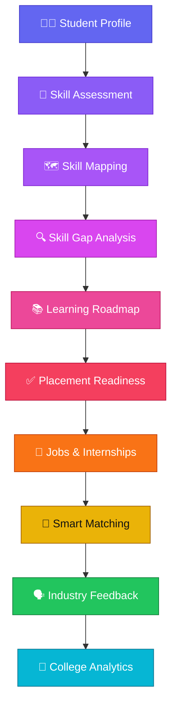

<div align="center">


<br/>

<p>
  
  
  
  
</p>

<p>
  
  
  
  
  
  
</p>

<p>
  
  
  
  
</p>

<h3>🎯 Assess &nbsp;→&nbsp; 🌉 Bridge &nbsp;→&nbsp; 📚 Learn &nbsp;→&nbsp; 🤝 Match &nbsp;→&nbsp; 📈 Grow</h3>

<a href="#-about-skillbridge">About</a> •
<a href="#-the-problem">Problem</a> •
<a href="#-our-solution">Solution</a> •
<a href="#-core-modules">Modules</a> •
<a href="#️-system-architecture">Architecture</a> •
<a href="#️-technology-stack">Tech Stack</a> •
<a href="#-run-locally">Run Locally</a> •
<a href="#-hackathon">Hackathon</a>

</div>

<br/>

## 🌟 About SkillBridge

> **SkillBridge** is a unified **Academia–Industry Collaboration Portal** that connects **Students**, **Industry**, and **Colleges** on a single platform — turning learning, skill assessment, internships, and placement from disconnected activities into one continuous, evidence-driven journey.

<div align="center">



</div>

<br/>

## 🎯 The Problem

Students, industries, and academic institutions often operate in **disconnected workflows** — leading to poor visibility, manual effort, and missed opportunities.

<table>
<tr>
<td width="33%" valign="top">

### 👨‍🎓 Students
- Difficulty identifying **verified skills**
- Limited visibility into skill gaps
- Unclear learning priorities
- Trouble finding relevant opportunities
- Limited evidence of industry readiness

</td>
<td width="33%" valign="top">

### 🏢 Industry
- Manual candidate screening
- Hard to compare skills vs. job needs
- Limited structured competency evidence
- Fragmented job/internship/feedback flows

</td>
<td width="33%" valign="top">

### 🏫 Academia
- Limited visibility into student readiness
- Hard to spot department-level skill gaps
- Limited visibility into industry demand
- Fragmented placement & assessment data

</td>
</tr>
</table>

<br/>

## 💡 Our Solution

SkillBridge unifies all three stakeholders into **one connected ecosystem**, with a dedicated, purpose-built experience for each.

<div align="center">

| 👨‍🎓 **Student** | 🏢 **Industry** | 🏫 **College** |
|:---|:---|:---|
| Profile & Skills | Company Profile | Student Readiness |
| Assessments | Jobs | Skill Gap Analytics |
| Skill Gap | Internships | Department Analytics |
| Learning Roadmap | Candidate Matching | Batch Analytics |
| Placement Readiness | Applicant Pipeline | Placement Analytics |
| Smart Apply | Mentor Feedback | Industry Engagement |
| Application Tracking | Candidate Dossier | Executive Reports |

</div>

<br/>

## ⚡ Core Modules

<details open>
<summary><b>01 — 🧪 Skill Assessment</b></summary>
<br/>

Interactive assessments evaluate student competency across multiple technical tracks:

`Frontend` · `Backend` · `Full Stack` · `Cloud`

Assessment results feed directly into **verified skill evidence** used across the platform.

</details>

<details>
<summary><b>02 — 🔍 Skill Gap Analysis</b></summary>
<br/>

SkillBridge compares student capability against industry-oriented role profiles, including:

- Full-Stack Software Engineer
- Cloud & DevOps Engineer
- AI/ML Engineer
- Data Systems Engineer

Students instantly see: **Matching Skills → Weak Skills → Missing Skills → Recommended Improvements**

</details>

<details>
<summary><b>03 — 📚 Personalized Learning Roadmap</b></summary>
<br/>

A structured, milestone-tracked learning pathway is generated for every student:

```text
Engineering Fundamentals → Applied Development → Scalable Cloud & Advanced Engineering → Industry Capstone
```

</details>

<details>
<summary><b>04 — ✅ Placement Readiness</b></summary>
<br/>

A **Placement Readiness Score** is computed from multiple evidence sources:

`Assessment Performance` · `Verified Skills` · `Projects` · `Certifications` · `Academic Standing` · `Roadmap Progress` · `Internship Evidence`

</details>

<details>
<summary><b>05 — 💼 Jobs & Internships</b></summary>
<br/>

Opportunities are clearly split into **Full-Time Jobs** and **Mentored Internships**, each showing required skills, match score, duration, stipend, work mode, and live application status.

</details>

<details>
<summary><b>06 — 🤝 Intelligent Matching</b></summary>
<br/>

A transparent, **weighted matching engine** scores every opportunity:

<div align="center">

| Matching Factor | Weight |
|:---|---:|
| 🧩 Technical Skill Overlap | **40%** |
| 🧪 Verified Assessment | **20%** |
| 🎯 Role Domain & Track | **15%** |
| 🛠️ Project Experience | **10%** |
| 🏅 Verified Certifications | **5%** |
| 🎓 Academic Standing | **10%** |

</div>

**Match Categories**

🟢 `80–100` Strong Fit &nbsp; 🔵 `60–79` Good Fit &nbsp; 🟡 `40–59` Developing &nbsp; 🔴 `<40` Low Match

</details>

<details>
<summary><b>07 — 🚀 Smart Apply</b></summary>
<br/>

Students apply using their verified profile, with applications tracked live:

`Applied → In Review → Shortlisted → Interview → Selected`

</details>

<details>
<summary><b>08 — 🗣️ Industry Mentor Feedback</b></summary>
<br/>

Mentors provide structured feedback across **7 competencies**: Technical Competence, Problem Solving, Communication, Teamwork, Professionalism, Learning Ability, and Overall Performance — plus notes on strengths, contributions, skill gaps, and growth recommendations.

</details>

<details>
<summary><b>09 — 🏫 College Analytics</b></summary>
<br/>

Institution-level visibility into Skill Readiness, Assessment Performance, Department & Batch Analytics, Skill Demand vs. Supply, Placement Funnel, Industry Engagement, and Executive Reports.

</details>

<br/>

## 🏗️ System Architecture

```text
┌───────────────────────────────────────────────────────────┐
│                        SKILLBRIDGE                         │
├─────────────────────┬─────────────────────┬────────────────┤
│      STUDENT        │       INDUSTRY       │     COLLEGE    │
├─────────────────────┼─────────────────────┼────────────────┤
│ Profile              │ Company Profile      │ Dashboard      │
│ Skills                │ Jobs                 │ Readiness      │
│ Assessment            │ Internships          │ Analytics      │
│ Skill Gap             │ Matching             │ Skill Gaps     │
│ Roadmap               │ Applications         │ Placement      │
│ Readiness             │ Mentor Feedback      │ Reports        │
└──────────┬────────────┴──────────┬───────────┴───────┬────────┘
           │                       │                    │
           └───────────────────────┼────────────────────┘
                                   ▼
                     ┌───────────────────────────┐
                     │    Skill Intelligence      │
                     ├───────────────────────────┤
                     │ Assessment Engine          │
                     │ Skill Gap Engine            │
                     │ Roadmap Engine               │
                     │ Matching Engine               │
                     │ Analytics Engine               │
                     └──────────────┬────────────────┘
                                    ▼
                       Persistent Application Data
```

<br/>

## 🛠️ Technology Stack

<div align="center">

**Frontend**


**Backend**


**Auth & Security**


</div>

| Layer | Details |
|---|---|
| 🎨 **Frontend** | React, TypeScript, Vite, Tailwind CSS |
| ⚙️ **Backend** | Node.js, Express, TypeScript |
| 🔐 **Auth & Security** | JWT Authentication, Role-Based Access Control, Protected APIs, Stakeholder-specific access |
| 🧠 **Data & Intelligence** | Persistent JSON database, Assessment Engine, Skill Gap Engine, Learning Roadmap Engine, Weighted Matching Engine, Analytics Engine |

<br/>

## 🔐 Security

SkillBridge enforces **role-based access control (RBAC)** across three stakeholder roles, backed by JWT-protected routes.

<table>
<tr>
<td width="33%" valign="top">

**👨‍🎓 Student**
- Personal Profile
- Assessments
- Applications

</td>
<td width="33%" valign="top">

**🏢 Industry**
- Company Data
- Opportunities
- Candidates

</td>
<td width="33%" valign="top">

**🏫 College Admin**
- Institutional Analytics
- Student Readiness
- Placement Insights

</td>
</tr>
</table>

> [!NOTE]
> Authentication is handled using **JWT-based protected routes**, ensuring each stakeholder only accesses data relevant to their role.

<br/>

## 📊 End-to-End Workflow

<div align="center">


</div>

<br/>

## 🚀 Run Locally

```bash
# 1️⃣ Clone the repository
git clone https://github.com/Ramprasanth07/SkillBridge.git
cd SkillBridge

# 2️⃣ Install dependencies
npm install

# 3️⃣ Start the application
npm run dev
```

Then open 👉 **`http://localhost:3000`**

<br/>

## 👥 Three-Portal Ecosystem

<div align="center">

| 👨‍🎓 STUDENT | 🏢 INDUSTRY | 🏫 COLLEGE |
|:---:|:---:|:---:|
| Learn | Recruit | Monitor |
| Assess | Match | Analyze |
| Improve | Evaluate | Improve |
| Apply | Give Feedback | Align Training |

**Learning → Industry → Feedback → Academic Improvement Loop** 🔁

</div>

<br/>

## 🎓 Hackathon

<div align="center">

| Detail | Information |
|---|---|
| 🏆 **Hackathon** | Smart India Hackathon 2026 |
| 🆔 **Problem Statement ID** | `SIH26044` |
| 📝 **Problem Statement** | Portal for Academia–Industry Collaboration for Skill Mapping, Internships and Placement |
| 🎨 **Theme** | Smart Automation |
| 📦 **Category** | Software |
| 🚀 **Project** | **SkillBridge** |

</div>

<br/>

## 🔮 Future Scope

- 🗄️ Production-grade relational database
- 🤖 ML-assisted opportunity matching
- 📊 Advanced recommendation systems
- 🏫 Large-scale multi-college deployment
- 📈 Industry skill-demand forecasting
- 🧾 Automated portfolio intelligence
- 🔬 Advanced recruitment analytics

> [!TIP]
> The current prototype uses a **transparent, rule-based weighted matching approach**. ML-based matching is planned as future scope.

<br/>

## 📌 Project Vision

<div align="center">

### *Connect learning with industry opportunity.*
### *Turn skills into evidence.*
### *Turn evidence into opportunities.*

<br/>

**🚀 SkillBridge**
### Assess • Bridge • Learn • Match • Grow

</div>

<br/>

<div align="center">


**Built for Smart India Hackathon 2026 — `SIH26044`**

⭐ **If you find this project interesting, consider giving it a star!** ⭐

</div>
